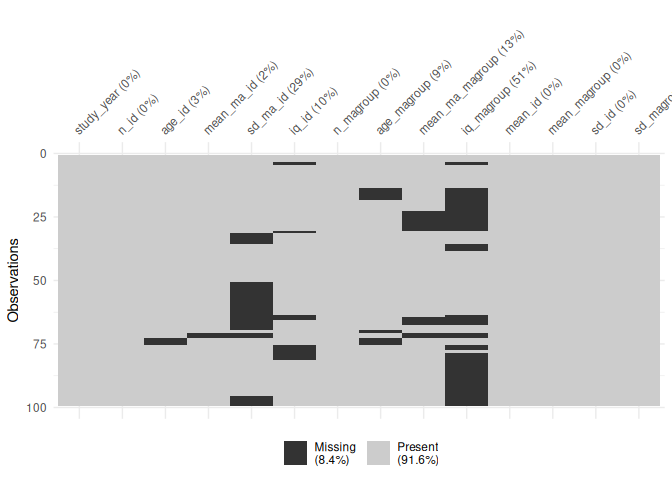
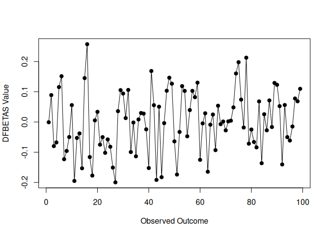
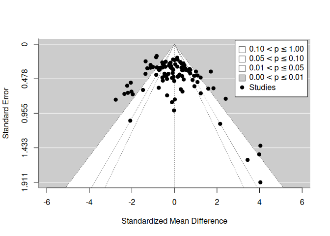
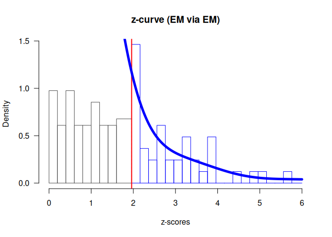

## Aim

The aim of the study is to investigate if short-term and working memory
abilities exhibit a developmentally delayed or developmentally different
pattern in children with ID. This will be done by an overall analysis
and subgroup analyses based on type of memory (short-term or working
memory), aetiology of ID (familial or organic). In addition, the overall
analysis will also be repeated with level of IQ as a moderator.

### Aims and Research questions

The aim of the study is to investigate if short-term and working memory
abilities exhibit a developmentally delayed or developmentally different
pattern in children with ID. This will be done by an overall analysis
and subgroup analyses based on the type of memory (short-term or working
memory) and the aetiology of ID (familial or organic). In addition, the
overall analysis will also be repeated with the level of the severity of
the intellectual disability as a moderator.

Our research questions are:

1.  Do short-term and working memory abilities exhibit a developmentally
    delayed or developmentally different pattern in children with ID
    (compared to mental age-matched groups)?

2.  Are these results consistent across the aetiology (familial and
    organic) of ID or level of IQ?

For research question 1, we cannot make a prediction as to whether there
will be significant differences in short-term and working memory
abilities between children with ID and a mental-age-matched comparison
group. However, we will use equivalence testing to find out whether
within the literature, there is significant statistical evidence to
support the delay and the difference hypotheses. Different statistical
outcomes and possible conclusions are further described in method
section below. For research question 2, we hypothesise, that both IQ and
ID origin will significantly moderate STM and WM performance.

## Methods

### Data extraction

We extracted data from stuff

### Statistical analysis

We tested the difference in performance moderating for type of task and
also for type of ID

### Equivalence testing

Yes

## Results

### Descriptives

We conducted and reported this systematic review according to NIRO-SR
guidelines for conducting and reporting systematic reviews of
non-intervention research (REF). See table X for descriptives of the
obtained studies.

    skim_data <- skim(data[, columns_of_interest])
    skim_data

<table>
<caption>Data summary</caption>
<tbody>
<tr class="odd">
<td style="text-align: left;">Name</td>
<td style="text-align: left;">data[, columns_of_interes…</td>
</tr>
<tr class="even">
<td style="text-align: left;">Number of rows</td>
<td style="text-align: left;">99</td>
</tr>
<tr class="odd">
<td style="text-align: left;">Number of columns</td>
<td style="text-align: left;">14</td>
</tr>
<tr class="even">
<td style="text-align: left;">_______________________</td>
<td style="text-align: left;"></td>
</tr>
<tr class="odd">
<td style="text-align: left;">Column type frequency:</td>
<td style="text-align: left;"></td>
</tr>
<tr class="even">
<td style="text-align: left;">numeric</td>
<td style="text-align: left;">14</td>
</tr>
<tr class="odd">
<td style="text-align: left;">________________________</td>
<td style="text-align: left;"></td>
</tr>
<tr class="even">
<td style="text-align: left;">Group variables</td>
<td style="text-align: left;">None</td>
</tr>
</tbody>
</table>

Data summary

**Variable type: numeric**

<table style="width:100%;">
<colgroup>
<col style="width: 15%" />
<col style="width: 9%" />
<col style="width: 13%" />
<col style="width: 7%" />
<col style="width: 6%" />
<col style="width: 7%" />
<col style="width: 7%" />
<col style="width: 7%" />
<col style="width: 7%" />
<col style="width: 7%" />
<col style="width: 5%" />
</colgroup>
<thead>
<tr class="header">
<th style="text-align: left;">skim_variable</th>
<th style="text-align: right;">n_missing</th>
<th style="text-align: right;">complete_rate</th>
<th style="text-align: right;">mean</th>
<th style="text-align: right;">sd</th>
<th style="text-align: right;">p0</th>
<th style="text-align: right;">p25</th>
<th style="text-align: right;">p50</th>
<th style="text-align: right;">p75</th>
<th style="text-align: right;">p100</th>
<th style="text-align: left;">hist</th>
</tr>
</thead>
<tbody>
<tr class="odd">
<td style="text-align: left;">study_year</td>
<td style="text-align: right;">0</td>
<td style="text-align: right;">1.00</td>
<td style="text-align: right;">2009.13</td>
<td style="text-align: right;">11.15</td>
<td style="text-align: right;">1962.00</td>
<td style="text-align: right;">2010.00</td>
<td style="text-align: right;">2012.00</td>
<td style="text-align: right;">2013.00</td>
<td style="text-align: right;">2020.00</td>
<td style="text-align: left;">▁▁▁▁▇</td>
</tr>
<tr class="even">
<td style="text-align: left;">n_id</td>
<td style="text-align: right;">0</td>
<td style="text-align: right;">1.00</td>
<td style="text-align: right;">22.46</td>
<td style="text-align: right;">11.19</td>
<td style="text-align: right;">10.00</td>
<td style="text-align: right;">15.00</td>
<td style="text-align: right;">19.00</td>
<td style="text-align: right;">26.00</td>
<td style="text-align: right;">68.00</td>
<td style="text-align: left;">▇▆▁▁▁</td>
</tr>
<tr class="odd">
<td style="text-align: left;">age_id</td>
<td style="text-align: right;">3</td>
<td style="text-align: right;">0.97</td>
<td style="text-align: right;">16.31</td>
<td style="text-align: right;">6.24</td>
<td style="text-align: right;">4.34</td>
<td style="text-align: right;">13.59</td>
<td style="text-align: right;">14.98</td>
<td style="text-align: right;">17.73</td>
<td style="text-align: right;">49.88</td>
<td style="text-align: left;">▃▇▁▁▁</td>
</tr>
<tr class="even">
<td style="text-align: left;">mean_ma_id</td>
<td style="text-align: right;">2</td>
<td style="text-align: right;">0.98</td>
<td style="text-align: right;">6.35</td>
<td style="text-align: right;">1.26</td>
<td style="text-align: right;">1.88</td>
<td style="text-align: right;">5.75</td>
<td style="text-align: right;">6.10</td>
<td style="text-align: right;">6.74</td>
<td style="text-align: right;">11.17</td>
<td style="text-align: left;">▁▂▇▁▁</td>
</tr>
<tr class="odd">
<td style="text-align: left;">sd_ma_id</td>
<td style="text-align: right;">29</td>
<td style="text-align: right;">0.71</td>
<td style="text-align: right;">2.06</td>
<td style="text-align: right;">4.82</td>
<td style="text-align: right;">0.37</td>
<td style="text-align: right;">0.67</td>
<td style="text-align: right;">0.93</td>
<td style="text-align: right;">1.56</td>
<td style="text-align: right;">24.61</td>
<td style="text-align: left;">▇▁▁▁▁</td>
</tr>
<tr class="even">
<td style="text-align: left;">iq_id</td>
<td style="text-align: right;">10</td>
<td style="text-align: right;">0.90</td>
<td style="text-align: right;">48.78</td>
<td style="text-align: right;">8.50</td>
<td style="text-align: right;">19.92</td>
<td style="text-align: right;">44.17</td>
<td style="text-align: right;">53.00</td>
<td style="text-align: right;">53.30</td>
<td style="text-align: right;">65.75</td>
<td style="text-align: left;">▁▂▂▇▁</td>
</tr>
<tr class="odd">
<td style="text-align: left;">n_magroup</td>
<td style="text-align: right;">0</td>
<td style="text-align: right;">1.00</td>
<td style="text-align: right;">25.78</td>
<td style="text-align: right;">14.07</td>
<td style="text-align: right;">10.00</td>
<td style="text-align: right;">15.00</td>
<td style="text-align: right;">22.00</td>
<td style="text-align: right;">28.00</td>
<td style="text-align: right;">65.00</td>
<td style="text-align: left;">▇▅▁▁▁</td>
</tr>
<tr class="even">
<td style="text-align: left;">age_magroup</td>
<td style="text-align: right;">9</td>
<td style="text-align: right;">0.91</td>
<td style="text-align: right;">6.57</td>
<td style="text-align: right;">1.32</td>
<td style="text-align: right;">1.93</td>
<td style="text-align: right;">5.75</td>
<td style="text-align: right;">6.27</td>
<td style="text-align: right;">7.55</td>
<td style="text-align: right;">11.17</td>
<td style="text-align: left;">▁▂▇▃▁</td>
</tr>
<tr class="odd">
<td style="text-align: left;">mean_ma_magroup</td>
<td style="text-align: right;">13</td>
<td style="text-align: right;">0.87</td>
<td style="text-align: right;">6.58</td>
<td style="text-align: right;">1.24</td>
<td style="text-align: right;">1.90</td>
<td style="text-align: right;">5.98</td>
<td style="text-align: right;">6.71</td>
<td style="text-align: right;">6.90</td>
<td style="text-align: right;">9.76</td>
<td style="text-align: left;">▁▂▇▇▂</td>
</tr>
<tr class="even">
<td style="text-align: left;">iq_magroup</td>
<td style="text-align: right;">50</td>
<td style="text-align: right;">0.49</td>
<td style="text-align: right;">102.73</td>
<td style="text-align: right;">8.78</td>
<td style="text-align: right;">94.00</td>
<td style="text-align: right;">95.70</td>
<td style="text-align: right;">95.70</td>
<td style="text-align: right;">109.00</td>
<td style="text-align: right;">123.56</td>
<td style="text-align: left;">▇▁▅▁▁</td>
</tr>
<tr class="odd">
<td style="text-align: left;">mean_id</td>
<td style="text-align: right;">0</td>
<td style="text-align: right;">1.00</td>
<td style="text-align: right;">53.96</td>
<td style="text-align: right;">164.97</td>
<td style="text-align: right;">0.04</td>
<td style="text-align: right;">3.84</td>
<td style="text-align: right;">9.93</td>
<td style="text-align: right;">22.74</td>
<td style="text-align: right;">1096.20</td>
<td style="text-align: left;">▇▁▁▁▁</td>
</tr>
<tr class="even">
<td style="text-align: left;">mean_magroup</td>
<td style="text-align: right;">0</td>
<td style="text-align: right;">1.00</td>
<td style="text-align: right;">52.19</td>
<td style="text-align: right;">165.84</td>
<td style="text-align: right;">0.03</td>
<td style="text-align: right;">3.78</td>
<td style="text-align: right;">9.67</td>
<td style="text-align: right;">22.81</td>
<td style="text-align: right;">1258.00</td>
<td style="text-align: left;">▇▁▁▁▁</td>
</tr>
<tr class="odd">
<td style="text-align: left;">sd_id</td>
<td style="text-align: right;">0</td>
<td style="text-align: right;">1.00</td>
<td style="text-align: right;">15.64</td>
<td style="text-align: right;">36.80</td>
<td style="text-align: right;">0.19</td>
<td style="text-align: right;">2.38</td>
<td style="text-align: right;">5.01</td>
<td style="text-align: right;">10.50</td>
<td style="text-align: right;">251.50</td>
<td style="text-align: left;">▇▁▁▁▁</td>
</tr>
<tr class="even">
<td style="text-align: left;">sd_magroup</td>
<td style="text-align: right;">0</td>
<td style="text-align: right;">1.00</td>
<td style="text-align: right;">12.10</td>
<td style="text-align: right;">32.96</td>
<td style="text-align: right;">0.13</td>
<td style="text-align: right;">1.90</td>
<td style="text-align: right;">3.50</td>
<td style="text-align: right;">5.52</td>
<td style="text-align: right;">277.90</td>
<td style="text-align: left;">▇▁▁▁▁</td>
</tr>
</tbody>
</table>

    missing_summary <- miss_var_summary(data[, columns_of_interest])
    iq_missing <- missing_summary[missing_summary$variable == "iq_id", "pct_miss"][[1]]
    iq_ma_missing <- missing_summary[missing_summary$variable == "iq_magroup", "pct_miss"][[1]]

<!---
For both groups, we extracted the IQ scores, number of participants, mean and SD of the performance in the tasks, and the mean and SD of the chronological and mental age. The variable with the most missing data was  with % data missing. IQ scores for the ID group were missing %, and for the MA group, % of IQ scores were missing.
-->

    missing_data <- vis_miss(data[,columns_of_interest])
    missing_data

    power_median <- pwr::pwr.t2n.test(n1 = 71, n2 = 62, power = 0.80, sig.level = 0.05, alternative = c("greater")) #taken from the largest study (Palmqvist, 2020) in the Spaniol & Danielsson MA

    power_median$d

    ## [1] 0.4344462

    pam_g <- escalc("SMD1", m1i = 5.9, m2i = 7, sd1i = 2.3, sd2i = 1.8, n1i = 71, n2i = 62) #taken from the Palmqvist (2020) working memory task scores

### Statistical analysis

We are performing a multilevel meta-analysis of memory span.

    res_inhibition <- rma.mv(yi, vi, random = list(~ 1 | effectsize_id, ~1 | study_id), 
                              tdist = TRUE, data = stats_test) 

    dat.comp <- data.frame(estimate = c(coef(res_inhibition)), 
                           stderror = c(res_inhibition$se),
                           tau2     = c(res_inhibition$tau2))
    dfround(dat.comp, 3)

    ##         estimate stderror tau2
    ## intrcpt   -0.092    0.088    0

    # Compute confidence intervals and format labels

    df <- stats_test[, c('cite', 'yi', 'sei', 'n_magroup', 'n_id')]
      
    df$cite <- paste0(df$cite, '.', ave(df$cite, df$cite, FUN = seq_along))
      df <- df %>%
        mutate(
          lower = yi - 1.96 * sei,  
          upper = yi + 1.96 * sei,  
          ci_text = paste0(round(yi,2), "  [", round(lower, 2), ", ", round(upper, 2), "]")
        )
    FE_model <- paste0('RE Model for the memory span outcome')
      df <- df %>%
        arrange(yi)
      df_2 <- data.frame(cite = FE_model, 
                         yi = res_inhibition['b'], 
                         sei = res_inhibition['se'], 
                         n_magroup = NA_integer_,
                         n_id = NA_integer_, 
                         lower= res_inhibition['ci.lb'], 
                         upper = res_inhibition['ci.ub'], 
                         ci_text = paste0(round(as.numeric(res_inhibition['b']),2), 
                               "  [", round(as.numeric(res_inhibition['ci.lb']), 2), ", ", 
                               round(as.numeric(res_inhibition['ci.ub']), 2), "]"))
      df <- bind_rows(df, df_2)
      df[, c('yi','sei', 'lower', 'upper')] <- lapply(df[, c('yi','sei', 'lower', 'upper')], as.numeric)
      df$desired_order <- seq(dim(df)[1],1)
      p_right <- ggplot(df, aes(y = reorder(cite, desired_order))) +
        geom_point(aes(x=yi), size = 3, shape=15, color = "darkred") +  
        geom_errorbarh(aes(xmin = lower, xmax = upper), height = 0.2, color = "grey") +  
        labs(
          x = "Effect Size (Hedges' g)",
          y = "Study",
          caption = "Error bars represent 95% confidence intervals"
        )   + theme(axis.line.y = element_blank(),
                    axis.ticks.y= element_blank(),
                    axis.text.y= element_blank(),
                    axis.title.y= element_blank(),
                    panel.background = element_rect(fill = "white"
                    )) + coord_cartesian(xlim = c(min(df$lower), max(df$upper)), ylim = c(0,dim(df)[1] + 1))
      p_left <- ggplot(df, aes(y = reorder(cite, desired_order))) + labs(x = '') +
        geom_text(aes(x = 0, label = cite), hjust = 0, fontface = "bold") +
        annotate(geom="text", x=0.3, y=dim(df)[1] + 1, label="Study", fontface = "bold") +
        geom_text(aes(x = 0.8, label = n_id), hjust = 0) +
        annotate(geom="text", x=0.8, y=dim(df)[1] + 1, label="N (ID)", fontface = "bold") +
        geom_text(aes(x = 1, label = n_magroup), hjust = 0) +
        annotate(geom="text", x=1, y=dim(df)[1] + 1, label="N (Control)", fontface = "bold") +
        geom_text(
          aes(x = 1.3, label = ci_text),
          hjust = 0
        ) +
        annotate(geom="text", x=1.4, y=dim(df)[1] + 1, label="Hedges' g [95% CI]", fontface = "bold") +
        theme_void() +
        coord_cartesian(xlim = c(0, 2), ylim = c(0,dim(df)[1] + 1))
      
      layout <- c(
        area(t = 0, l = 0, b = dim(df)[1], r = 5), 
        area(t = 0, l = 6, b = dim(df)[1], r = 8) 
      )
      print(p_left + p_right + plot_layout(design = layout))

    ## Warning: Removed 1 row containing missing values or values outside the scale range
    ## (`geom_text()`).
    ## Removed 1 row containing missing values or values outside the scale range
    ## (`geom_text()`).

    ## Warning: Removed 1 row containing missing values or values outside the scale range
    ## (`geom_point()`).

    ## Warning: Removed 1 row containing missing values or values outside the scale range
    ## (`geom_errorbarh()`).

#### Moderator analyses

Moderating type of ID origin for memory span.

    #subgroup analysis (RE meta-analysis of each group)
    res_DS <- rma.mv(yi, vi, random = list(~ 1 | effectsize_id, ~1 | study_id),
                              subset = group_id == "DS",
                              tdist = TRUE, data = stats_test) # this will be our organic origin
    res_NSID <- rma.mv(yi, vi, random = list(~ 1 | effectsize_id, ~1 | study_id),
                              subset = group_id == "NSID",
                              tdist = TRUE, data = stats_test) # this will be our non-specific origin

    dat.comp <- data.frame(alloc    = c("DS", "NSID"
                                        ), 
                           estimate = c(coef(res_DS), coef(res_NSID)
                                        ), 
                           stderror = c(res_DS$se, res_NSID$se
                                        ),
                           tau2     = c(res_DS$tau2, res_NSID$tau2
                                       )
                           )
    dfround(dat.comp, 3)

    ##   alloc estimate stderror tau2
    ## 1    DS   -0.175    0.119    0
    ## 2  NSID   -0.116    0.138    0

    #fixed effects meta-analysis of the subgroup estimates
    # taken from: https://www.metafor-project.org/doku.php/tips:comp_two_independent_estimates#separate_meta-analyses
    rma(estimate, sei=stderror, mods = ~ alloc, method="FE", data=dat.comp, digits=3)

    ## 
    ## Fixed-Effects with Moderators Model (k = 2)
    ## 
    ## I^2 (residual heterogeneity / unaccounted variability): 0.00%
    ## H^2 (unaccounted variability / sampling variability):   1.00
    ## R^2 (amount of heterogeneity accounted for):            NA%
    ## 
    ## Test for Residual Heterogeneity:
    ## QE(df = 0) = 0.000, p-val = 1.000
    ## 
    ## Test of Moderators (coefficient 2):
    ## QM(df = 1) = 0.107, p-val = 0.744
    ## 
    ## Model Results:
    ## 
    ##            estimate     se    zval   pval   ci.lb  ci.ub    
    ## intrcpt      -0.175  0.119  -1.474  0.140  -0.408  0.058    
    ## allocNSID     0.060  0.182   0.327  0.744  -0.297  0.416    
    ## 
    ## ---
    ## Signif. codes:  0 '***' 0.001 '**' 0.01 '*' 0.05 '.' 0.1 ' ' 1

    id_tests <- t(data.frame(DS = c(res_DS$b, res_DS$se,res_DS$ci.lb, res_DS$ci.ub),
                             NSID = c(res_NSID$b, res_NSID$se,res_NSID$ci.lb, res_NSID$ci.ub),
                             row.names = c('b', 'se', 'ci.lb', 'ci.ub')))
    for (id in c('DS', 'NSID'
                )
         ){
      df <- stats_test[stats_test$group_id == id, c('cite', 'yi', 'sei', 'n_magroup', 'n_id')]
      
      # Compute confidence intervals and format labels
      
      df$cite <- paste0(df$cite, '.', ave(df$cite, df$cite, FUN = seq_along))
      df <- df %>%
        mutate(
          lower = yi - 1.96 * sei,  
          upper = yi + 1.96 * sei,  
          ci_text = paste0(round(yi,2), "  [", round(lower, 2), ", ", round(upper, 2), "]")
        )
      FE_model <- paste0('RE Model for ', id, ' group')
      df <- df %>%
        arrange(yi)
      df <- rbind(df, c(FE_model, id_tests[id,'b'], id_tests[id,'se'], '','', 
                        id_tests[id,'ci.lb'], id_tests[id,'ci.ub'], 
                        paste0(round(id_tests[id,'b'],2), 
                               "  [", round(id_tests[id,'ci.lb'], 2), ", ", 
                               round(id_tests[id,'ci.ub'], 2), "]")))
      df[, c('yi','sei', 'lower', 'upper')] <- lapply(df[, c('yi','sei', 'lower', 'upper')], as.numeric)
      df$desired_order <- seq(dim(df)[1],1)
      p_right <- ggplot(df, aes(y = reorder(cite, desired_order))) +
        geom_point(aes(x=yi), size = 3, shape=15, color = "darkred") +  
        geom_errorbarh(aes(xmin = lower, xmax = upper), height = 0.2, color = "grey") +  
        labs(
          x = "Effect Size (Hedges' g)",
          y = "Study",
          caption = "Error bars represent 95% confidence intervals"
        )   + theme(axis.line.y = element_blank(),
                    axis.ticks.y= element_blank(),
                    axis.text.y= element_blank(),
                    axis.title.y= element_blank(),
                    panel.background = element_rect(fill = "white"
                    )) + coord_cartesian(xlim = c(min(df$lower), max(df$upper)), ylim = c(0,dim(df)[1] + 1))
      p_left <- ggplot(df, aes(y = reorder(cite, desired_order))) + labs(x = '') +
        geom_text(aes(x = 0, label = cite), hjust = 0, fontface = "bold") +
        annotate(geom="text", x=0.3, y=dim(df)[1] + 1, label="Study", fontface = "bold") +
        geom_text(aes(x = 0.8, label = n_id), hjust = 0) +
        annotate(geom="text", x=0.8, y=dim(df)[1] + 1, label="N (ID)", fontface = "bold") +
        geom_text(aes(x = 1, label = n_magroup), hjust = 0) +
        annotate(geom="text", x=1, y=dim(df)[1] + 1, label="N (Control)", fontface = "bold") +
        geom_text(
          aes(x = 1.3, label = ci_text),
          hjust = 0
        ) +
        annotate(geom="text", x=1.4, y=dim(df)[1] + 1, label="Hedges' g [95% CI]", fontface = "bold") +
        theme_void() +
        coord_cartesian(xlim = c(0, 2), ylim = c(0,dim(df)[1] + 1))
      
      layout <- c(
        area(t = 0, l = 0, b = dim(df)[1], r = 5), 
        area(t = 0, l = 6, b = dim(df)[1], r = 8) 
      )
      print(p_left + p_right + plot_layout(design = layout))
      Sys.sleep(2)
    }

### Equivalence testing

The studies looked at different types of executive functions (CHANGE
THIS LATER TO SUIT OUR OWN ANALYSIS). In the next table you can see the
extracted descriptives separated by executive function.

    describeBy(data[,columns_of_interest], data$ef_type)

    ## 
    ##  Descriptive statistics by group 
    ## group: attention
    ##                 vars  n    mean    sd  median trimmed  mad     min     max
    ## study_year         1 16 2011.94  2.24 2012.00 2011.57 1.48 2010.00 2019.00
    ## n_id               2 16   22.06  9.44   15.00   21.29 0.00   15.00   40.00
    ## age_id             3 16   16.51  5.08   17.60   16.19 2.92    9.59   27.81
    ## mean_ma_id         4 16    5.74  0.82    5.92    5.77 0.86    4.47    6.70
    ## sd_ma_id           5 10    0.84  0.30    0.90    0.83 0.15    0.37    1.38
    ## iq_id              6 12   46.37 12.02   53.00   48.32 0.44   19.92   53.30
    ## n_magroup          7 16   24.38 10.97   16.00   23.93 1.48   15.00   40.00
    ## age_magroup        8 16    6.20  1.45    6.58    6.24 1.52    4.15    7.60
    ## mean_ma_magroup    9 13    6.06  1.15    6.90    6.13 0.00    4.45    6.90
    ## iq_magroup        10  8   94.85  0.91   94.85   94.85 1.26   94.00   95.70
    ## mean_id           11 16   26.95 34.79   10.06   22.99 6.62    2.13  107.30
    ## mean_magroup      12 16   26.12 33.38    8.50   22.80 3.72    1.96   96.80
    ## sd_id             13 16    6.90  7.16    3.72    6.05 4.43    0.42   25.20
    ## sd_magroup        14 16    5.03  6.51    1.64    4.29 1.80    0.35   20.10
    ##                  range  skew kurtosis   se
    ## study_year        9.00  1.79     3.42 0.56
    ## n_id             25.00  0.78    -1.04 2.36
    ## age_id           18.22  0.25    -0.62 1.27
    ## mean_ma_id        2.23 -0.38    -1.33 0.20
    ## sd_ma_id          1.01 -0.16    -0.83 0.10
    ## iq_id            33.38 -1.25    -0.16 3.47
    ## n_magroup        25.00  0.45    -1.70 2.74
    ## age_magroup       3.45 -0.33    -1.71 0.36
    ## mean_ma_magroup   2.45 -0.56    -1.72 0.32
    ## iq_magroup        1.70  0.00    -2.23 0.32
    ## mean_id         105.17  1.40     0.43 8.70
    ## mean_magroup     94.84  1.25    -0.14 8.34
    ## sd_id            24.78  1.10     0.18 1.79
    ## sd_magroup       19.75  1.35     0.15 1.63
    ## ------------------------------------------------------------ 
    ## group: fluency
    ##                 vars  n    mean    sd  median trimmed   mad     min     max
    ## study_year         1 12 2011.17  4.57 2012.00 2011.10  1.48 2003.00 2020.00
    ## n_id               2 12   26.50 13.71   24.00   23.50  2.97   15.00   68.00
    ## age_id             3 12   14.31  1.41   13.64   14.05  0.70   13.17   18.10
    ## mean_ma_id         4 12    6.39  1.19    6.38    6.38  1.24    4.50    8.39
    ## sd_ma_id           5 10    1.15  0.36    1.10    1.16  0.54    0.67    1.58
    ## iq_id              6 12   45.00  9.26   45.26   45.30 10.91   30.65   56.33
    ## n_magroup          7 12   26.50 12.03   26.00   24.10  4.45   15.00   62.00
    ## age_magroup        8 12    6.31  0.96    6.14    6.30  1.17    4.92    7.84
    ## mean_ma_magroup    9 10    6.77  1.42    6.53    6.83  2.19    4.50    8.55
    ## iq_magroup        10  3  109.00  0.00  109.00  109.00  0.00  109.00  109.00
    ## mean_id           11 12   17.78  9.16   16.60   16.79 10.85    7.13   38.30
    ## mean_magroup      12 12   18.01  8.74   14.99   17.11  9.01    8.00   37.00
    ## sd_id             13 12    7.50  2.76    8.59    7.52  3.42    2.77   12.10
    ## sd_magroup        14 12    5.74  1.65    5.31    5.68  1.55    3.26    8.73
    ##                 range  skew kurtosis   se
    ## study_year      17.00 -0.33    -0.13 1.32
    ## n_id            53.00  2.20     4.07 3.96
    ## age_id           4.93  1.47     1.45 0.41
    ## mean_ma_id       3.89 -0.14    -1.13 0.34
    ## sd_ma_id         0.92  0.00    -1.73 0.12
    ## iq_id           25.68 -0.22    -1.41 2.67
    ## n_magroup       47.00  1.98     3.47 3.47
    ## age_magroup      2.92  0.09    -1.37 0.28
    ## mean_ma_magroup  4.05 -0.41    -1.30 0.45
    ## iq_magroup       0.00   NaN      NaN 0.00
    ## mean_id         31.17  0.69    -0.49 2.65
    ## mean_magroup    29.00  0.68    -0.73 2.52
    ## sd_id            9.33 -0.12    -1.32 0.80
    ## sd_magroup       5.47  0.28    -1.35 0.48
    ## ------------------------------------------------------------ 
    ## group: inhibition
    ##                 vars  n    mean     sd  median trimmed  mad     min     max
    ## study_year         1 37 2011.95   3.94 2013.00 2012.29 1.48 2001.00 2018.00
    ## n_id               2 37   20.70   8.11   19.00   20.13 7.41   11.00   42.00
    ## age_id             3 37   16.64   7.91   14.68   15.30 1.70    4.34   49.88
    ## mean_ma_id         4 35    6.51   1.71    6.10    6.44 0.82    1.88   11.17
    ## sd_ma_id           5 24    4.10   7.93    1.10    2.40 0.74    0.54   24.61
    ## iq_id              6 34   48.88   8.41   53.00   49.48 9.04   30.65   59.10
    ## n_magroup          7 37   27.30  16.24   21.00   24.90 8.90   13.00   65.00
    ## age_magroup        8 34    6.63   1.63    6.14    6.60 1.76    1.93   11.17
    ## mean_ma_magroup    9 32    6.53   1.48    6.53    6.60 1.25    1.90    9.76
    ## iq_magroup        10 18  103.57   8.09  107.20  102.92 4.37   94.00  123.56
    ## mean_id           11 37   64.21 189.01    7.08   13.01 9.27    0.45  948.90
    ## mean_magroup      12 37   57.89 161.58    7.00   12.47 9.00    0.25  706.70
    ## sd_id             13 37   16.03  36.81    4.79    7.46 4.54    0.19  205.40
    ## sd_magroup        14 37    9.30  20.68    3.27    3.74 2.15    0.13   95.40
    ##                  range  skew kurtosis    se
    ## study_year       17.00 -0.83     0.82  0.65
    ## n_id             31.00  0.67    -0.55  1.33
    ## age_id           45.54  2.82     8.75  1.30
    ## mean_ma_id        9.30  0.51     1.43  0.29
    ## sd_ma_id         24.07  2.11     2.60  1.62
    ## iq_id            28.45 -0.57    -0.89  1.44
    ## n_magroup        52.00  1.36     0.48  2.67
    ## age_magroup       9.24  0.07     1.27  0.28
    ## mean_ma_magroup   7.86 -0.54     1.42  0.26
    ## iq_magroup       29.56  0.45    -0.34  1.91
    ## mean_id         948.45  3.46    11.67 31.07
    ## mean_magroup    706.45  3.04     7.88 26.56
    ## sd_id           205.21  3.94    16.47  6.05
    ## sd_magroup       95.27  3.08     8.43  3.40
    ## ------------------------------------------------------------ 
    ## group: other
    ##                 vars n    mean    sd  median trimmed   mad     min     max
    ## study_year         1 9 2013.00  4.03 2012.00 2013.00  2.97 2008.00 2020.00
    ## n_id               2 9   25.00 16.72   18.00   25.00  4.45   15.00   65.00
    ## age_id             3 9   17.58  5.72   17.60   17.58  2.24   10.10   30.30
    ## mean_ma_id         4 9    6.89  0.91    6.70    6.89  1.07    5.54    8.43
    ## sd_ma_id           5 6    1.15  0.44    1.17    1.15  0.51    0.52    1.58
    ## iq_id              6 8   53.52  3.22   53.30   53.52  2.45   46.57   56.33
    ## n_magroup          7 9   26.00 17.02   18.00   26.00  4.45   15.00   62.00
    ## age_magroup        8 8    7.51  0.18    7.50    7.51  0.15    7.33    7.84
    ## mean_ma_magroup    9 9    7.23  0.95    6.90    7.23  1.04    5.30    8.55
    ## iq_magroup        10 6   99.57  7.35   95.70   99.57  2.52   94.00  109.00
    ## mean_id           11 9   18.46 26.54    7.80   18.46 11.51    0.04   84.90
    ## mean_magroup      12 9   24.43 29.30   12.50   24.43 15.42    0.03   87.00
    ## sd_id             13 9    6.06  5.81    3.80    6.06  3.11    0.83   15.98
    ## sd_magroup        14 9    9.05 15.32    2.20    9.05  2.10    0.78   47.75
    ##                 range  skew kurtosis   se
    ## study_year      12.00  0.64    -1.11 1.34
    ## n_id            50.00  1.47     0.74 5.57
    ## age_id          20.20  0.87     0.12 1.91
    ## mean_ma_id       2.89  0.13    -1.34 0.30
    ## sd_ma_id         1.06 -0.20    -1.94 0.18
    ## iq_id            9.76 -1.01    -0.07 1.14
    ## n_magroup       47.00  1.17    -0.40 5.67
    ## age_magroup      0.51  0.49    -1.24 0.06
    ## mean_ma_magroup  3.25 -0.52    -0.60 0.32
    ## iq_magroup      15.00  0.51    -1.96 3.00
    ## mean_id         84.86  1.63     1.43 8.85
    ## mean_magroup    86.97  1.08    -0.37 9.77
    ## sd_id           15.15  0.84    -1.08 1.94
    ## sd_magroup      46.97  1.74     1.57 5.11
    ## ------------------------------------------------------------ 
    ## group: shifting
    ##                 vars  n    mean     sd  median trimmed   mad     min     max
    ## study_year         1 24 2000.42  19.51 2010.00 2002.70  4.45 1962.00 2019.00
    ## n_id               2 24   22.25  12.95   15.50   20.35  7.41   10.00   67.00
    ## age_id             3 21   15.12   3.11   15.17   15.18  3.60   10.10   20.02
    ## mean_ma_id         4 24    6.31   0.70    6.10    6.24  0.52    5.27    8.33
    ## sd_ma_id           5 19    0.91   0.32    0.90    0.89  0.35    0.54    1.58
    ## iq_id              6 23   50.20   6.58   53.00   50.35  5.01   37.90   65.75
    ## n_magroup          7 24   23.83  13.12   18.00   22.10  5.93   10.00   62.00
    ## age_magroup        8 19    6.58   0.95    6.14    6.59  1.54    5.10    7.84
    ## mean_ma_magroup    9 21    6.63   0.82    6.53    6.58  0.55    5.30    8.55
    ## iq_magroup        10 14  106.18  10.60  109.00  106.19 13.79   94.00  118.30
    ## mean_id           11 24   89.61 235.97    8.98   29.25  8.93    0.81 1096.20
    ## mean_magroup      12 24   90.14 268.75    7.00   20.05  7.87    1.10 1258.00
    ## sd_id             13 24   29.02  57.31    3.19   15.11  3.14    0.85  251.50
    ## sd_magroup        14 24   25.77  59.82    3.35   11.11  2.18    1.30  277.90
    ##                   range  skew kurtosis    se
    ## study_year        57.00 -1.05    -0.76  3.98
    ## n_id              57.00  1.89     3.50  2.64
    ## age_id             9.92  0.00    -1.38  0.68
    ## mean_ma_id         3.06  1.06     0.71  0.14
    ## sd_ma_id           1.04  0.78    -0.42  0.07
    ## iq_id             27.85 -0.24     0.10  1.37
    ## n_magroup         52.00  1.31     0.92  2.68
    ## age_magroup        2.74 -0.13    -1.69  0.22
    ## mean_ma_magroup    3.25  0.61    -0.11  0.18
    ## iq_magroup        24.30 -0.09    -1.95  2.83
    ## mean_id         1095.39  3.37    11.08 48.17
    ## mean_magroup    1256.90  3.55    12.09 54.86
    ## sd_id            250.65  2.70     7.10 11.70
    ## sd_magroup       276.60  3.23    10.38 12.21
    ## ------------------------------------------------------------ 
    ## group: updating
    ##                 vars n    mean sd  median trimmed mad     min     max range
    ## study_year         1 1 2010.00 NA 2010.00 2010.00   0 2010.00 2010.00     0
    ## n_id               2 1   28.00 NA   28.00   28.00   0   28.00   28.00     0
    ## age_id             3 1   38.30 NA   38.30   38.30   0   38.30   38.30     0
    ## mean_ma_id         4 1    6.17 NA    6.17    6.17   0    6.17    6.17     0
    ## sd_ma_id           5 1    1.50 NA    1.50    1.50   0    1.50    1.50     0
    ## iq_id              6 0     NaN NA      NA     NaN  NA     Inf    -Inf  -Inf
    ## n_magroup          7 1   28.00 NA   28.00   28.00   0   28.00   28.00     0
    ## age_magroup        8 1    6.40 NA    6.40    6.40   0    6.40    6.40     0
    ## mean_ma_magroup    9 1    6.50 NA    6.50    6.50   0    6.50    6.50     0
    ## iq_magroup        10 0     NaN NA      NA     NaN  NA     Inf    -Inf  -Inf
    ## mean_id           11 1    5.04 NA    5.04    5.04   0    5.04    5.04     0
    ## mean_magroup      12 1    7.29 NA    7.29    7.29   0    7.29    7.29     0
    ## sd_id             13 1    3.76 NA    3.76    3.76   0    3.76    3.76     0
    ## sd_magroup        14 1    3.98 NA    3.98    3.98   0    3.98    3.98     0
    ##                 skew kurtosis se
    ## study_year        NA       NA NA
    ## n_id              NA       NA NA
    ## age_id            NA       NA NA
    ## mean_ma_id        NA       NA NA
    ## sd_ma_id          NA       NA NA
    ## iq_id             NA       NA NA
    ## n_magroup         NA       NA NA
    ## age_magroup       NA       NA NA
    ## mean_ma_magroup   NA       NA NA
    ## iq_magroup        NA       NA NA
    ## mean_id           NA       NA NA
    ## mean_magroup      NA       NA NA
    ## sd_id             NA       NA NA
    ## sd_magroup        NA       NA NA

Equivalence testing for the different types of tasks.

    # Overall meta-analyses of STM and WM
    inhibition <- stats_test[stats_test$ef_type == 'inhibition',]
    inhibition_model <- rma(yi, vi, data = inhibition)
    inhibition_results <- ma_pipe_sei(
      inhibition,
      true_effect = inhibition_model$b,
      rep_lower = inhibition_model$ci.lb,
      rep_upper = inhibition_model$ci.ub,
      analysis_title = "Short-term memory tasks",
      plot = TRUE
    )

    ## 

    ## 

    ## NHST: don't reject null significance hypothesis that the effect is equal to 0 
    ## TOST: don't reject null equivalence hypothesis

    ## Warning: Using `size` aesthetic for lines was deprecated in ggplot2 3.4.0.
    ## ℹ Please use `linewidth` instead.
    ## This warning is displayed once every 8 hours.
    ## Call `lifecycle::last_lifecycle_warnings()` to see where this warning was
    ## generated.

    inhibition_et_dat <- inhibition_results$et

    # Subgroup analyses for each outcome (here only presented one)
    inhibition_DS <- stats_test[stats_test$ef_type == 'inhibition' & stats_test$group_id == "DS",]
    inhibition_model_DS <- rma(yi, vi, data = inhibition_DS)
    inhibition_results_DS <- ma_pipe_sei(
      inhibition_DS,
      true_effect = inhibition_model_DS$b,
      rep_lower = inhibition_model_DS$ci.lb,
      rep_upper = inhibition_model_DS$ci.ub,
      analysis_title = "STM tasks for organic origin",
      plot = TRUE
    )

    ## 

    ## 

    ## NHST: don't reject null significance hypothesis that the effect is equal to 0 
    ## TOST: don't reject null equivalence hypothesis

    inhibition_et_dat_DS <- inhibition_results_DS$et

    inhibition_NSID <- stats_test[stats_test$ef_type == 'inhibition' & stats_test$group_id == "NSID",]
    inhibition_model_NSID <- rma(yi, vi, data = inhibition_NSID)
    inhibition_results_NSID <- ma_pipe_sei(
      inhibition_NSID,
      true_effect = inhibition_model_NSID$b,
      rep_lower = inhibition_model_NSID$ci.lb,
      rep_upper = inhibition_model_NSID$ci.ub,
      analysis_title = "STM tasks for familial origin",
      plot = TRUE
    )

    ## 

    ## 

    ## NHST: don't reject null significance hypothesis that the effect is equal to 0 
    ## TOST: don't reject null equivalence hypothesis

    inhibition_et_dat_NSID <- inhibition_results_NSID$et

    ## equivalence forest plot
    com1 <- rbind(inhibition_et_dat,
                  inhibition_et_dat_DS, inhibition_et_dat_NSID)

    com1 <- combine_et(com1)

    com1 <- com1 + ggtitle("Summary effect sizes and equivalence bounds") +
      theme(plot.title = element_text(hjust = 0.5))

    com1

# Moderator analysis

    meta_reg <- rma(m1i = mean_magroup, sd1i = sd_magroup, n1i = n_magroup,
                    m2i = mean_id, sd2i = sd_id, n2i = n_id, method = "REML", measure = 'SMD1H',
                    mods = ~ iq_id, data=stats_test) #IQ predictor will be mean-centered

    ## Warning: 10 studies with NAs omitted from model fitting.

    summary(meta_reg)

    ## 
    ## Mixed-Effects Model (k = 89; tau^2 estimator: REML)
    ## 
    ##   logLik  deviance       AIC       BIC      AICc   
    ## -99.5133  199.0265  205.0265  212.4243  205.3157   
    ## 
    ## tau^2 (estimated amount of residual heterogeneity):     0.4111 (SE = 0.0780)
    ## tau (square root of estimated tau^2 value):             0.6412
    ## I^2 (residual heterogeneity / unaccounted variability): 83.40%
    ## H^2 (unaccounted variability / sampling variability):   6.02
    ## R^2 (amount of heterogeneity accounted for):            0.00%
    ## 
    ## Test for Residual Heterogeneity:
    ## QE(df = 87) = 406.2475, p-val < .0001
    ## 
    ## Test of Moderators (coefficient 2):
    ## QM(df = 1) = 0.1751, p-val = 0.6756
    ## 
    ## Model Results:
    ## 
    ##          estimate      se     zval    pval    ci.lb   ci.ub    
    ## intrcpt   -0.0548  0.4423  -0.1238  0.9014  -0.9218  0.8122    
    ## iq_id      0.0037  0.0090   0.4184  0.6756  -0.0138  0.0213    
    ## 
    ## ---
    ## Signif. codes:  0 '***' 0.001 '**' 0.01 '*' 0.05 '.' 0.1 ' ' 1

## Sensitivity analysis

    # Cook's distance
    sens_inh <- cooks.distance.rma.mv(res_inhibition)
    plot(sens_inh, type="o", pch=19, xlab="Observed Outcome", ylab="Cook's Distance")

    ## "leave-one-out" analysis with dfbetas value for dependent effect size multilevel analyses
    loneo <- dfbetas(res_inhibition) %>% as.matrix()
    plot(loneo, type="o", pch=19, xlab="Observed Outcome", ylab="DFBETAS Value")

    ## sensitivity analysis for the inclusion criteria
    #subgroup analysis (RE meta-analysis of each group)
    stats_test <- stats_test %>% mutate(group_inclusion_criteria = sample(c("group_a","group_b","group_c","group_d"), n(), replace = TRUE))

    res_a <- rma.mv(yi, vi, random = list(~ 1 | effectsize_id, ~1 | study_id),
                              subset = group_inclusion_criteria == "group_a",
                              tdist = TRUE, data = stats_test) # studies reported every participant’s IQ score
    res_b <- rma.mv(yi, vi, random = list(~ 1 | effectsize_id, ~1 | study_id),
                              subset = group_inclusion_criteria == "group_b",
                              tdist = TRUE, data = stats_test) # studies report the participants have been diagnosed with ID
    res_c <- rma.mv(yi, vi, random = list(~ 1 | effectsize_id, ~1 | study_id),
                              subset = group_inclusion_criteria == "group_c",
                              tdist = TRUE, data = stats_test) # studies only reports the mean IQ score lower than 60
    res_d <- rma.mv(yi, vi, random = list(~ 1 | effectsize_id, ~1 | study_id),
                              subset = group_inclusion_criteria == "group_d",
                              tdist = TRUE, data = stats_test) # studies report ID diagnosis and eligible IQ scores

    dat.comp.incl <- data.frame(alloc    = c("group_a", "group_b", "group_c", "group_d"
                                        ), 
                           estimate = c(coef(res_a), coef(res_b), coef(res_c), coef(res_d)
                                        ), 
                           stderror = c(res_a$se, res_b$se, res_c$se, res_d$se
                                        ),
                           tau2     = c(res_a$tau2, res_b$tau2, res_c$tau2, res_d$tau2 
                                       )
                           )
    dfround(dat.comp.incl, 3)

    ##     alloc estimate stderror tau2
    ## 1 group_a   -0.073    0.215    0
    ## 2 group_b   -0.087    0.118    0
    ## 3 group_c   -0.217    0.262    0
    ## 4 group_d   -0.059    0.157    0

    # contour enhanced funnel plot, funnel centered at 0
    funnel_data <- funnel(res_inhibition, level=c(90, 95, 99), refline=0, legend=TRUE)

    # p-curve, R-Index are calculated in the Shiny App, .csv file with necessary data is on OSF. Link to the p-checker: https://shiny.psy.lmu.de/felix/p-checker/

    # z-curve
    zdata <- data.frame(z = stats_test$yi / sqrt(stats_test$vi),
                        p = 2 * pnorm(-abs(stats_test$yi / sqrt(stats_test$vi))))
    fit <- zcurve(as.numeric(zdata[,"z"]))
    summary(fit)

    ## Call:
    ## zcurve(z = as.numeric(zdata[, "z"]))
    ## 
    ## model: EM via EM
    ## 
    ##     Estimate  l.CI  u.CI
    ## ERR    0.494 0.270 0.707
    ## EDR    0.106 0.050 0.520
    ## 
    ## Model converged in 92 + 358 iterations
    ## Fitted using 41 z-values. 99 supplied, 41 significant (ODR = 0.41, 95% CI [0.32, 0.52]).
    ## Q = -38.48, 95% CI[-51.54, -22.80]

    plot(fit)

    #pet-peese: code modified from https://bookdown.org/MathiasHarrer/Doing_Meta_Analysis_in_R/pub-bias.html#small-study-effects
    dat.petpeese <- data.frame(TE = stats_test$yi,
                               seTE_c = sqrt((stats_test$n_id+stats_test$n_magroup)/(stats_test$n_id*stats_test$n_magroup)),
                               seTE_c2 = (stats_test$n_id+stats_test$n_magroup)/(stats_test$n_id*stats_test$n_magroup))

    pet <- rma.mv(TE, seTE_c2, mods = ~seTE_c, data = dat.petpeese, method = "FE")
    peese <- rma.mv(TE, seTE_c2, mods = ~seTE_c2, data = dat.petpeese, method = "FE")

    sessionInfo()

    ## R version 4.4.3 (2025-02-28)
    ## Platform: x86_64-pc-linux-gnu
    ## Running under: Ubuntu 25.04
    ## 
    ## Matrix products: default
    ## BLAS:   /usr/lib/x86_64-linux-gnu/openblas-pthread/libblas.so.3 
    ## LAPACK: /usr/lib/x86_64-linux-gnu/openblas-pthread/libopenblasp-r0.3.29.so;  LAPACK version 3.12.0
    ## 
    ## locale:
    ##  [1] LC_CTYPE=en_US.UTF-8       LC_NUMERIC=C              
    ##  [3] LC_TIME=sv_SE.UTF-8        LC_COLLATE=en_US.UTF-8    
    ##  [5] LC_MONETARY=sv_SE.UTF-8    LC_MESSAGES=en_US.UTF-8   
    ##  [7] LC_PAPER=sv_SE.UTF-8       LC_NAME=C                 
    ##  [9] LC_ADDRESS=C               LC_TELEPHONE=C            
    ## [11] LC_MEASUREMENT=sv_SE.UTF-8 LC_IDENTIFICATION=C       
    ## 
    ## time zone: Europe/Stockholm
    ## tzcode source: system (glibc)
    ## 
    ## attached base packages:
    ## [1] stats     graphics  grDevices utils     datasets  methods   base     
    ## 
    ## other attached packages:
    ##  [1] zcurve_2.4.5        pwr_1.3-0           psych_2.4.12       
    ##  [4] skimr_2.2.1         naniar_1.1.0        dmetar_0.1.0       
    ##  [7] ggrepel_0.9.6       devtools_2.4.5      usethis_3.1.0      
    ## [10] tidyr_1.3.1         dplyr_1.1.4         TOSTER_0.8.3       
    ## [13] patchwork_1.3.0     ggthemes_5.1.0      ggplot2_3.5.1      
    ## [16] readr_2.1.5         metaviz_0.3.1       reshape_0.8.9      
    ## [19] janitor_2.2.1       readxl_1.4.5        metafor_4.6-0      
    ## [22] numDeriv_2016.8-1.1 metadat_1.2-0       Matrix_1.7-3       
    ## 
    ## loaded via a namespace (and not attached):
    ##   [1] mathjaxr_1.6-0       rstudioapi_0.17.1    jsonlite_1.9.1      
    ##   [4] magrittr_2.0.3       modeltools_0.2-23    farver_2.1.2        
    ##   [7] nloptr_2.2.1         rmarkdown_2.29       fs_1.6.5            
    ##  [10] vctrs_0.6.5          memoise_2.0.1        minqa_1.2.8         
    ##  [13] CompQuadForm_1.4.3   base64enc_0.1-3      htmltools_0.5.8.1   
    ##  [16] distributional_0.5.0 cellranger_1.1.0     htmlwidgets_1.6.4   
    ##  [19] plyr_1.8.9           poibin_1.6           lubridate_1.9.4     
    ##  [22] cachem_1.1.0         mime_0.12            lifecycle_1.0.4     
    ##  [25] pkgconfig_2.0.3      R6_2.6.1             fastmap_1.2.0       
    ##  [28] rbibutils_2.3        shiny_1.10.0         magic_1.6-1         
    ##  [31] snakecase_0.11.1     digest_0.6.37        colorspace_2.1-1    
    ##  [34] pkgload_1.4.0        labeling_0.4.3       timechange_0.3.0    
    ##  [37] abind_1.4-8          compiler_4.4.3       remotes_2.5.0       
    ##  [40] withr_3.0.2          meta_8.0-1           pkgbuild_1.4.6      
    ##  [43] MASS_7.3-65          sessioninfo_1.2.3    tools_4.4.3         
    ##  [46] prabclus_2.3-4       httpuv_1.6.15        visdat_0.6.0        
    ##  [49] nnet_7.3-20          glue_1.8.0           nlme_3.1-167        
    ##  [52] promises_1.3.2       grid_4.4.3           cluster_2.1.8.1     
    ##  [55] generics_0.1.3       gtable_0.3.6         tzdb_0.5.0          
    ##  [58] class_7.3-23         hms_1.1.3            xml2_1.3.8          
    ##  [61] flexmix_2.3-20       pillar_1.10.1        ggdist_3.3.2        
    ##  [64] stringr_1.5.1        later_1.4.1          robustbase_0.99-4-1 
    ##  [67] splines_4.4.3        lattice_0.22-6       tidyselect_1.2.1    
    ##  [70] pbapply_1.7-2        miniUI_0.1.1.1       knitr_1.50          
    ##  [73] reformulas_0.4.0     gridExtra_2.3        stats4_4.4.3        
    ##  [76] xfun_0.51            diptest_0.77-1       DEoptimR_1.1-3-1    
    ##  [79] MuMIn_1.48.4         netmeta_2.9-0        stringi_1.8.4       
    ##  [82] yaml_2.3.10          boot_1.3-31          evaluate_1.0.3      
    ##  [85] kernlab_0.9-33       tibble_3.2.1         cli_3.6.4           
    ##  [88] xtable_1.8-4         Rdpack_2.6.3         repr_1.1.7          
    ##  [91] munsell_0.5.1        Rcpp_1.0.14          parallel_4.4.3      
    ##  [94] ellipsis_0.3.2       mclust_6.1.1         profvis_0.4.0       
    ##  [97] urlchecker_1.0.1     lme4_1.1-36          scales_1.3.0        
    ## [100] crayon_1.5.3         purrr_1.0.4          fpc_2.2-13          
    ## [103] rlang_1.1.5          mnormt_2.1.1         cowplot_1.1.3
